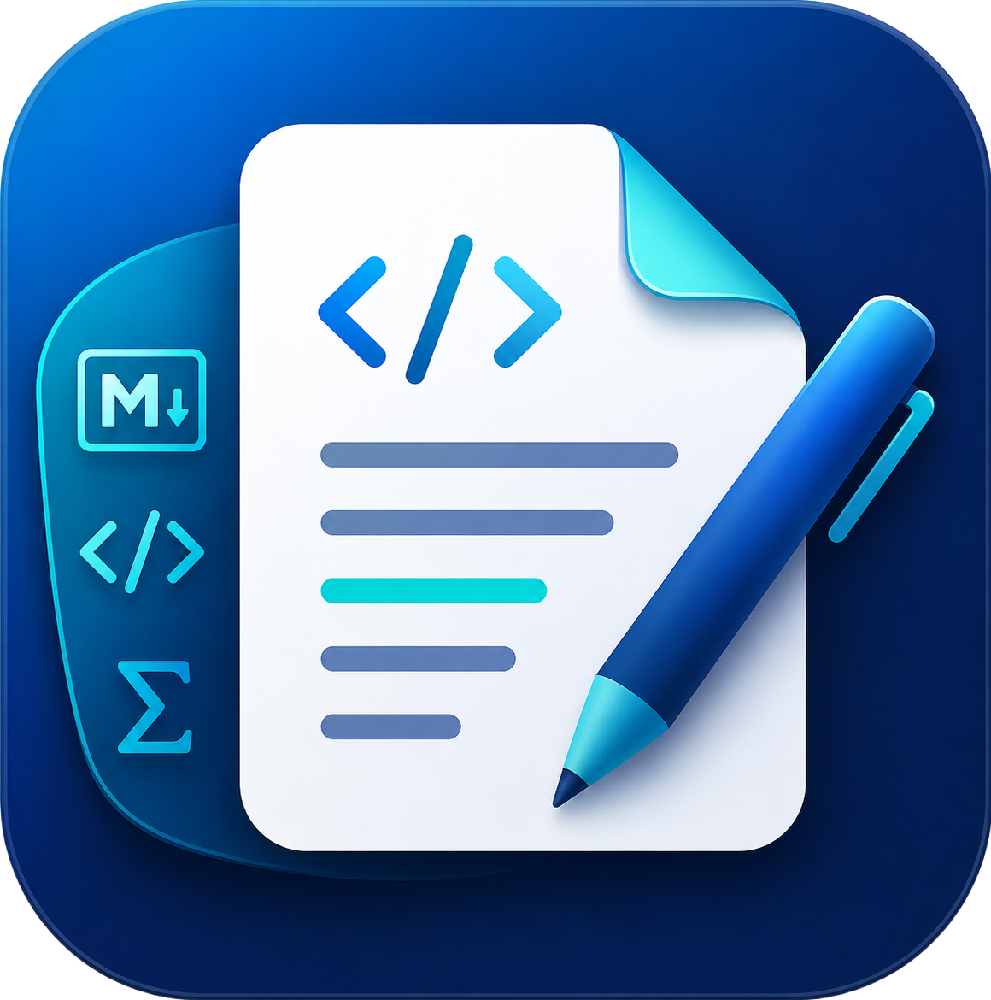
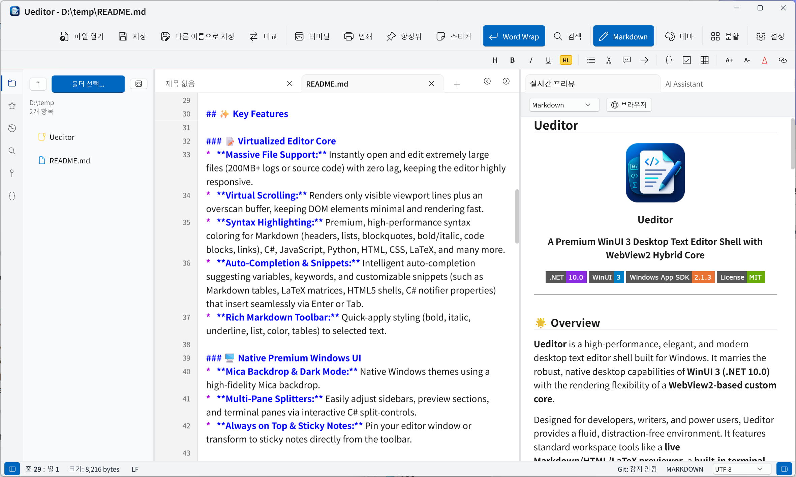

# Ueditor

<p align="center">
  
</p>

<h3 align="center">Ueditor</h3>

<p align="center">
  <strong>A Premium WinUI 3 Desktop Text Editor Shell with WebView2 Hybrid Core</strong>
</p>

<p align="center">
  <a href="https://dotnet.microsoft.com/download/dotnet/10.0"></a>
  <a href="https://learn.microsoft.com/en-us/windows/apps/winui/winui3/"></a>
  <a href="https://github.com/microsoft/WindowsAppSDK"></a>
  <a href="LICENSE"></a>
</p>

---

## 🌟 Overview

**Ueditor** is a high-performance, elegant, and modern desktop text editor shell built for Windows. It marries the robust, native desktop capabilities of **WinUI 3 (.NET 10.0)** with the rendering flexibility of a **WebView2-based custom core**. 

Designed for developers, writers, and power users, Ueditor provides a fluid, distraction-free environment. It features standard workspace tools like a **live Markdown/HTML/LaTeX previewer**, a **built-in terminal**, **comprehensive Git integration**, **multi-provider secure AI assistance**, and a **virtualized editor core** capable of opening and editing files from small snippets to 200MB+ logs seamlessly.

<p align="center">
  
</p>

---

## ✨ Key Features

### 📝 Virtualized Editor Core
*   **Massive File Support:** Instantly open and edit extremely large files (200MB+ logs or source code) with zero lag, keeping the editor highly responsive.
*   **Virtual Scrolling:** Renders only visible viewport lines plus an overscan buffer, keeping DOM elements minimal and rendering fast.
*   **Syntax Highlighting:** Premium, high-performance syntax coloring for Markdown (headers, lists, blockquotes, bold/italic, code blocks, links), C#, JavaScript, Python, HTML, CSS, LaTeX, and many more.
*   **Auto-Completion & Snippets:** Intelligent auto-completion suggesting variables, keywords, and customizable snippets (such as Markdown tables, LaTeX matrices, HTML5 shells, C# notifier properties) that insert seamlessly via Enter or Tab.
*   **Rich Markdown Toolbar:** Quick-apply styling (bold, italic, underline, list, color, tables) to selected text.

### 💾 Auto-Save
*   **Smart Background Auto-Save:** Automatically saves modified files within the active Git repository folder every 5 seconds.
*   **Workspace-Aware:** Only triggers when a Git repository folder is opened in the editor.

### 🖥️ Native Premium Windows UI
*   **Mica Backdrop & Dark Mode:** Native Windows themes using a high-fidelity Mica backdrop.
*   **Multi-Pane Splitters:** Easily adjust sidebars, preview sections, and terminal panes via interactive C# split-controls.
*   **Always on Top & Sticky Notes:** Pin your editor window or transform to sticky notes directly from the toolbar.

### 👁️ Real-Time Preview
*   **Live Renderer:** View Markdown, HTML, Aozora or LaTeX (powered by KaTeX) in a split view or an external browser.

### 🤖 Secure AI Assistant
*   **Multi-Provider:** Connect with Gemini, OpenAI, or local LM Studio endpoints.
*   **Secure Storage:** API keys are securely saved via native Windows Credential Manager.
*   **AI Translation:** Fast translation of selected text to/from Korean, English, Japanese, Chinese, French, Spanish, German, etc. while safely preserving code structure, markdown formatting, and commands.
*   **AI Custom Commands:** Execute custom prompts, instructions, and arbitrary questions directly on selected editor blocks or file contexts.
*   **Context Actions:** Quick AI actions (Explain, Refactor, Summarize, Fix) on selected text.

### 💻 Embedded Native Terminal
*   **PowerShell:** Launch terminal sessions directly beneath your editor canvas.
*   **Path Syncing:** Automatically matches the terminal's working directory with the active workspace.

### 🌿 Git Panel
*   **Status Tracker:** View staged/unstaged changes, stage/unstage files, execute commits, and push to remotes.
*   **History Viewer:** Visual repository branch and commit history logs.

### ⭐ Favorites
*   **File & Folder Bookmarks:** Pin any file or folder to your Favorites panel for instant one-click access — no more digging through deep directory trees.
*   **Right-Click to Add:** Simply **right-click** any file or folder in the Explorer panel and select **"Add to Favorites"** from the context menu.

### 🔍 Advanced Search
*   **Global Lookup:** Folder-wide multi-file search with Match Case, Whole Word, and Regex filtering.
*   **Jump-to-Source:** Double-click search results to open the file and focus the exact line.

### 📑 Table of Contents (TOC) & Document Outline
*   **Smart Outline Generator:** Automatically parses and generates a structural document outline based on the active file:
    *   **Markdown:** Maps H1 through H6 headings (`#` to `######`) to hierarchical tree levels.
    *   **Aozora Bunko:** Supports Japanese Aozora text files, parsing block/inline/wrapped headings while cleaning ruby markup (`《...》`, `｜`) and tags for a distraction-free overview.
    *   **Code Outline:** Builds structural trees of classes, methods, structs, or functions for major languages including **C#**, **Python**, **JavaScript/TypeScript**, and **Go** (with a general signature fallback for others).
*   **Interactive Jump:** Double-clicking any outline item instantly scrolls the viewport to focus the target line.

### 🌐 Multilingual Support
* Native support for English (`en-US`), Korean (`ko-KR`), and Japanese (`ja-JP`). The user interface automatically adapts to your system language or preferred settings for a fully localized desktop experience.

## ⌨️ Keyboard Shortcuts & Special Features

Ueditor is designed for speed and productivity, packing standard IDE shortcuts and premium interactive elements.

### 🔌 Keyboard Shortcuts

| Shortcut | Description |
| :--- | :--- |
| `Ctrl + N` | New Tab |
| `Ctrl + S` | Save File |
| `Ctrl + Shift + S` | Save As |
| `Ctrl + O` | Open File |
| `Ctrl + F` | Find / Search |
| `Ctrl + W` | Close Tab |
| `Ctrl + P` | Print |
| `Ctrl + 1` | Toggle Left Panel |
| `Ctrl + 2` | Toggle Right Panel |
| `` Ctrl + ` `` | Toggle Terminal |
| `Ctrl + Z` | Undo |
| `Ctrl + Y` | Redo |
| `Ctrl + C` | Copy |
| `Ctrl + V` | Paste |
| `Ctrl + X` | Cut |
| `Ctrl + Mouse Wheel` | Zoom In / Out |
| `Ctrl + Enter` | Send AI Prompt |
| `F9` | Toggle Always on Top |
| `F10` | Toggle Theme (Dark / Light) |
| `F12` | Toggle Sticky Note Mode |

### 🖱️ Column Selection (Multi-Cursor Selection)

*   **Column Drag Selection:**
    *   Hold **`Alt` + Mouse Drag** (or **`Shift + Alt` + Mouse Drag**) to select text in a vertical block or column.
    *   This places cursors on multiple consecutive lines, enabling you to edit, write, or delete text across multiple rows simultaneously.

### 🛠️ Interactive Tool Buttons

*   **Custom Text Color Selector:**
    *   **Right-Click** on the `TextColor` button to summon the native **Color Picker** dialog, allowing you to select and configure custom text colors precisely.
*   **AI Target Language Selector:**
    *   **Right-Click** on the translate button to open a context menu enabling you to switch target translation languages (Korean, English, Japanese, Chinese, French, Spanish, German) instantly.
*   **Add to Favorites:**
    *   **Right-Click** any file or folder in the Explorer panel and choose **"Add to Favorites"** to instantly pin it to your Favorites sidebar for quick access.

## 🚀 Getting Started

### 📥 Download
You can download the latest installer (built using **Inno Setup**) from the [Releases Page](https://github.com/kirinonakar/Ueditor/releases).

### Manual build Prerequisites

To build and run Ueditor locally, make sure you have:
*   **Windows 10 / 11**
*   **Visual Studio 2022** (v17.10 or later recommended)
*   **.NET 10.0 SDK**
*   **Windows App SDK** component installed inside Visual Studio.
*   **WebView2 Runtime** (installed by default on modern Windows).

### How to Run

1.  **Clone the Repository:**
    ```bash
    git clone https://github.com/kirinonakar/Ueditor.git
    cd Ueditor
    ```
2.  **Open the Solution:**
    Open the `Ueditor.slnx` (or `Ueditor.csproj`) inside Visual Studio.
3.  **Restore & Build:**
    Visual Studio will automatically restore NuGet packages (such as `Microsoft.WindowsAppSDK`).
4.  **Run:**
    Set the startup project to `Ueditor` and press `F5` to build and run in unpackaged mode.

---

## 📄 License

This project is licensed under the MIT License - see the [LICENSE](LICENSE) file for details.

Copyright (c) 2026 **kirinonakar**. All rights reserved.

### Third-Party Licenses

This software includes Mermaid.

**Mermaid**  
License: MIT License  
Copyright (c) 2014 - 2022 Knut Sveidqvist  

Permission is hereby granted, free of charge, to any person obtaining a copy
of this software and associated documentation files (the "Software"), to deal
in the Software without restriction, including without limitation the rights
to use, copy, modify, merge, publish, distribute, sublicense, and/or sell
copies of the Software, and to permit persons to whom the Software is
furnished to do so, subject to the following conditions:

The above copyright notice and this permission notice shall be included in all
copies or substantial portions of the Software.

THE SOFTWARE IS PROVIDED "AS IS", WITHOUT WARRANTY OF ANY KIND, EXPRESS OR
IMPLIED, INCLUDING BUT NOT LIMITED TO THE WARRANTIES OF MERCHANTABILITY,
FITNESS FOR A PARTICULAR PURPOSE AND NONINFRINGEMENT. IN NO EVENT SHALL THE
AUTHORS OR COPYRIGHT HOLDERS BE LIABLE FOR ANY CLAIM, DAMAGES OR OTHER
LIABILITY, WHETHER IN AN ACTION OF CONTRACT, TORT OR OTHERWISE, ARISING FROM,
OUT OF OR IN CONNECTION WITH THE SOFTWARE OR THE USE OR OTHER DEALINGS IN THE
SOFTWARE.
